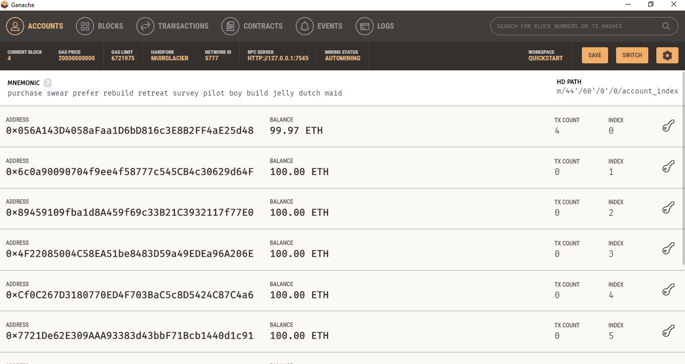
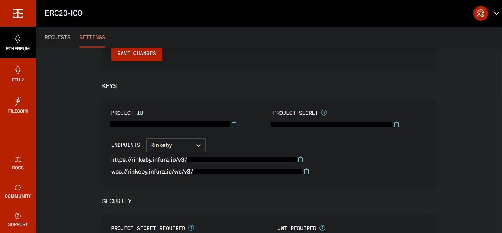
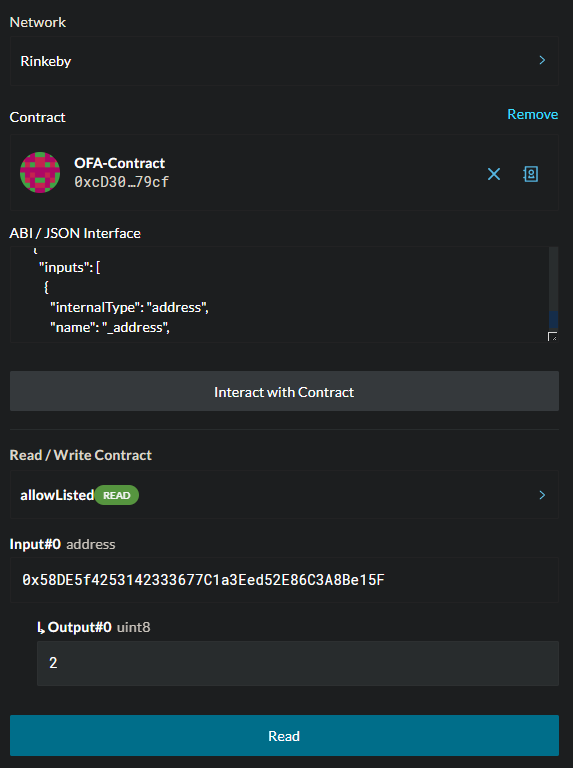
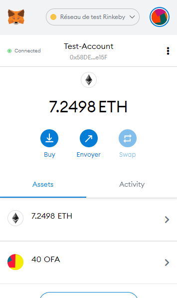

1. [Presentation](#presentation)
2. [Functions and code review](#function)
3. [Migration](#migration)
    1. [To Ganache](#ganache)
    2. [To Rinkeby testnet](#rinkeby)
        1. [HDWalletProvider](#hdwalletprovider)
        2. [Infura](#infura)
        3. [Setting up a Truffle project](#truffleproject)
        4. [Deploying the contract](#deployment)
3. [Manipulation on the Rinkeby testnet](#manipulation)

# Presentation <a name="presentation"></a>

This very simple smart contract written on a single [file](contracts/OFAToken.sol) simulates the ICO (Initial Coin Offering) of the **OneForAll (OFA)** token based on the **ERC20** standard.

The installation of the openzeppelin library ```npm install @openzeppelin/contracts```, simplifies the development of smart-contracts thanks to the integration of ERC standards and their direct use.

```solidity
// SPDX-License-Identifier: MIT
pragma solidity >=0.4.22 <0.9.0;

import "@openzeppelin/contracts/token/ERC20/ERC20.sol";

contract OFAToken is ERC20 {

    address owner;
    uint8 initdecimals = 18; // same as default erc20 (eth)

    // uint256 initSupply = 1400 * 10^initdecimals;

    constructor() ERC20("OneForAll", "OFA") {
        owner = msg.sender;
        _setupDecimals(initdecimals); // not required since it's the same as the default
        
        // _mint(address(this), initSupply);
    }
}
```

Thanks to the import of the *ERC20.sol* file from the openzeppelin library we were able to create in only a few lines our first contract that generates OneForAll tokens with 'OFA' as its ticker. 

For ease of use the decimals number has been kept at 18 as it would have been by default if the line ```_setupDecimals(initdecimals);``` had not been entered.

Finally, the *total supply* can be minted directly in the contract before being redistributed but our approach will be to mint it directly in the address that will have sent us ether if and only if this address belongs to our **whitelist**.


# Functions and code review <a name="function"></a>

Our intention is to launch an ICO which will be accessible to only a few addresses.

Every address that belongs to the whitelist *allowListed* must be given a tier level (1 to 3) that will grant it more or less OFAs, with tier 3 being the most important. This data is stored in a mapping made public ```mapping(address => uint8) public allowListed;```.

We write a ```modifier onlyAdmin``` that verifies whether a function call is made from the address that deployed the contract or not, indeed, functions such as ```function addCustomer(address _address, uint8 _tier) public onlyAdmin``` that would add an address and a tier level in *allowListed* must not be executed by anyone other than the administrator.

```solidity
mapping(address => uint8) public allowListed; // uint for tier 1, 2 or 3

function addCustomer(address _address, uint8 _tier) public onlyAdmin {
    require(_tier == 1 || _tier == 2 || _tier == 3 || _tier == 0);
    allowListed[_address] = _tier;
}

modifier onlyAdmin () {
    require(msg.sender == owner);
    _;
}
```

---

Before sending OFAs we have to make sure that we receive ETH, the function ```fallback () external payable onlyListed``` will be executed when the contract receives Ether. As before, the ```onlyListed``` modifier checks that the address sending Ether does belongs to *allowListed*, otherwise they will not be able to send Ether to the contract nor receive OFA.

The function ```getToken(uint256 _ethsend, address _sender) internal``` called from within the fallback will then mint to this address 10 x [tier level] x [number of eth sent to the contract] OneForAll tokens.

```solidity
fallback () external payable onlyListed {
    require(msg.value != 0);
    getToken(msg.value, msg.sender);
}

function getToken(uint256 _ethsend, address _sender) internal {
    uint8 _multiplicator = 10 * allowListed[_sender]; // allowListed[msg.sender] = tier level = 1 or 2 or 3
    _mint(msg.sender, _ethsend*_multiplicator);
}

modifier onlyListed () {
    require(allowListed[msg.sender] != 0);
    _;
}
```

# Migration <a name="migration"></a>

## To Ganache <a name="ganache"></a>

La migration vers **Ganache** se fait très simplement grâce à **Truffle** initialisé au début de projet qui nous permet facilement d'écrire, compiler et déployer des smart contracts grâce à un environnement intégré.

Lancer un workspace ethereum sur ganache et repérer le *RPC Server* à priori sur HTTP://127.0.0.1:7545.

On complète dans le fichier [truffle-config.js](truffle-config.js)

```js
module.exports = {
  networks: {
    development: {
      host: "127.0.0.1",
      port: 7545,
      network_id: "*" // can be replaced by Ganache network id
    }
  }
};
```

Puis dans le terminal :
```
truffle migrate
```

On peut remarquer que la première adresse a été créditée car par défaut c'est elle qui est utilisé pour déployer le contrat. Dans l'onglet 'BLOCKS' 4 blocs ont été ajoutés et les transactions sont visibles dans l'onglet 'TRANSACTIONS'.



Il est ensuite possible d'intéragir avec le contrat pour le tester depuis la console avec truffle.

```
truffle console
```
```
truffle(development)>
```

## To Rinkeby testnet <a name="rinkeby"></a>

### HDWalletProvider <a name="hdwalletprovider"></a>

Afin de migrer vers un testnet on a besoin de HDWalletProvider de truffle : ```npm install @truffle/hdwallet-provider```.

### Infura <a name="infura"></a>

Il faut aussi s'enregistrer à **Infura** qui est une infrastructure permettant permet aux développeurs de Dapps *'applications décentralisées'* d’accéder aux informations de la blockchain Ethereum sans avoir besoin de posséder un noeud complet. Une fois enregistré, il faut créer un projet, selectionner un *endpoints* (testnet Rinkeby pour notre part) et récupérer la clé API ou *Project ID* et le premier morceau de l'adresse https.



### Setting up a Truffle project <a name="truffleproject"></a>

Dans le fichier [truffle-config.js](truffle-config.js) les lignes suivantes permettrent de définir l'object HDWalletProvider et utiliser le module dotenv.

```js
const HDWalletProvider = require('@truffle/hdwallet-provider');
require('dotenv').config()

const mnemonic = process.env.MNENOMIC
const infuraKey = process.env.INFURA_API_KEY
```

Dans un fichier ```.env``` à la racine du projet inscrire la seed de l'adresse déployant le contrat et qui sera dès lors l'admin ainsi que le project ID récupéré précedemment.

```
MNENOMIC = "orange apple banana ..."
INFURA_API_KEY = <INFURA_PROJECT_ID>
```

On défini ensuite le réseau vers lequelle déployer : 

```js
module.exports = {
  networks: {
    rinkeby: {
      provider: () => new HDWalletProvider(mnemonic, "https://rinkeby.infura.io/v3/" + infuraKey, 1), // second account generated by the mnemonic (index 1)
      network_id: 4, // Rinkeby's id
      gas: 4500000,
      gasPrice: 10000000000,
    },
```

*Si l'on souhaite utiliser une autre adresse que la première généré par la seed, on peut préciser son index en paramètre de ```HDWalletProvider()```.*

### Deploying the contract <a name="deployment"></a>

Compiler le projet.

```
truffle compile
```

Puis déployer vers le réseau souhaité.

```
truffle migrate --network rinkeby
```

La console devrait afficher la réponse suivante :

```
Starting migrations...
======================
> Network name:    'rinkeby'
> Network id:      4
> Block gas limit: 10000000 (0x989680)


1_initial_migration.js
======================

   Deploying 'Migrations'
   ----------------------
   > transaction hash:    0x2ef9d24da6c6b1501b69f19f0f9732ed5cf5959b318848e8cf131aef13227c25
   > Blocks: 0            Seconds: 12
   > contract address:    0xd5Df66C27FF5Bd53Cc48fEAC832984EFDC993da0
   > block number:        8244084
   > block timestamp:     1615894442
   > account:             0xc80E625d5a29d8d377D360ba9c0fd2Cded049F94
   > balance:             8.049068485
   > gas used:            186951 (0x2da47)
   > gas price:           10 gwei
   > value sent:          0 ETH
   > total cost:          0.00186951 ETH


   > Saving migration to chain.
   > Saving artifacts
   -------------------------------------
   > Total cost:          0.00186951 ETH


2_deploy_contract.js
====================

   Deploying 'OFAToken'
   --------------------
   > transaction hash:    0xaf3c0daaed553adf6cfe9ce85408b76f01b88bf6a6dfed4b6569ddda7ff56a35
   > Blocks: 1            Seconds: 12
   > contract address:    0xcD30CDAfBB3FC9cDb6e12Fa725F7659749ED79cf
   > block number:        8244086
   > block timestamp:     1615894472
   > account:             0xc80E625d5a29d8d377D360ba9c0fd2Cded049F94
   > balance:             8.035203895
   > gas used:            1344124 (0x14827c)
   > gas price:           10 gwei
   > value sent:          0 ETH
   > total cost:          0.01344124 ETH


   > Saving migration to chain.
   > Saving artifacts
   -------------------------------------
   > Total cost:          0.01344124 ETH


Summary
=======
> Total deployments:   2
> Final cost:          0.01531075 ETH
```

Le hash de la transaction est la suivante *0xaf3c0daaed553adf6cfe9ce85408b76f01b88bf6a6dfed4b6569ddda7ff56a35* visible à cette [adresse](https://rinkeby.etherscan.io/tx/0xaf3c0daaed553adf6cfe9ce85408b76f01b88bf6a6dfed4b6569ddda7ff56a35), et l'adresse du contrat OFAToken ***0xcD30CDAfBB3FC9cDb6e12Fa725F7659749ED79cf*** visible [ici](https://rinkeby.etherscan.io/address/0xcd30cdafbb3fc9cdb6e12fa725f7659749ed79cf).

# Manipulation on the Rinkeby testnet <a name="manipulation"></a>

Si vous n'êtes pas sur la whitelist vous ne pourrez pas recevoir des OFA, il vous faut alors m'envoyer votre addresse erc20 pour que je puisse vous ajouter (vous pouvez essayer de le faire vous même vous verrez que vous en avez pas l'autorisation).

Il est possible depuis [mycrypto.com](https://app.mycrypto.com/interact-with-contracts) d'interagir avec le contrat en fournissant son adresse et son [ABI](./build/contracts/OFAToken.json), puis en entrant son adresse personelle dans la fonction allowListed lire le niveau de tier attribué.



---

Si le niveau de tier est différent de '0' alors vous pourrez recevoir des tokens OneForAll depuis cette adresse en envoyant des Ether au contrat.



\* *Pour rappel, vous recevrez 10 x [niveau de tier] x [eth envoyé] tokens OFA.*